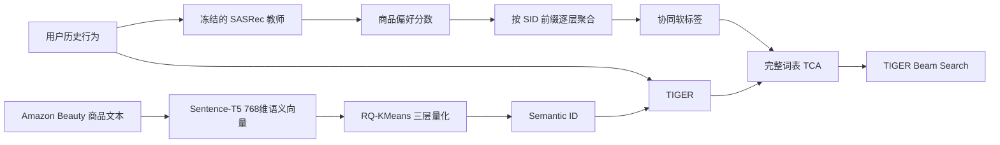

# TCA-TIGER：基于语义 ID 的生成式推荐与协同知识对齐

本项目基于 TIGER 搭建语义 ID（Semantic ID，SID）生成式推荐系统，并参考 TCA4Rec 将 SASRec 学习到的协同知识引入 TIGER。核心思路是：将 SASRec 在商品空间中的用户偏好，按照 SID 的层级前缀逐步聚合为词元级软标签，从而对 TIGER 的生成过程进行协同知识对齐。

在 Amazon Beauty 数据集的单随机种子实验中，相比原始 TIGER，最终模型的 SID 级 **NDCG@5 提升 9.69%，NDCG@10 提升 6.47%**；SASRec 仅用于离线生成训练监督，最终推理阶段仍然只需要 TIGER，不增加教师模型的线上推理开销。

> 本项目是将 TCA4Rec 的词元级协同对齐思想适配到 TIGER 的工程实践，并非 TIGER 或 TCA4Rec 的官方实现。所有结果均使用验证集 NDCG@10 选择最优模型，测试集不参与模型选择。

## 项目动机

TIGER 首先将商品表示为离散的 Semantic ID，再根据用户历史行为自回归生成下一商品的 SID。

本项目使用 Sentence-T5 提取商品文本的 768 维语义向量，再通过三层 RQ-KMeans 将商品量化为：

```text
[c0, c1, c2]
```

这种 SID 主要描述商品之间的文本语义关系。

但推荐系统不仅需要理解“商品是什么”，还需要理解：

* 哪些商品经常被相似用户共同交互；
* 用户当前更偏好哪些商品；
* 用户历史行为体现了怎样的序列偏好。

这些信息属于用户—商品之间的**协同行为信息**，仅依靠商品文本语义难以充分表达。

因此，本项目引入冻结的 SASRec 作为协同教师模型，将其在商品空间中学习到的用户偏好转换到 SID 空间，用于增强 TIGER 的生成训练。

## 整体方法



本项目的核心改造是：

> 将 TCA4Rec 的词元级协同对齐方法适配到 TIGER，把商品空间中的协同偏好转换为**前缀条件的分层 SID 监督信号**。

教师概率缓存只使用训练集中的因果历史生成，并通过确定性的样本键与 TIGER 训练样本逐条对齐。

## 完整词表 TCA

每个商品的 SID 表示为：

$$
y=[c_0,c_1,c_2]
$$

每层包含 256 个编码。

TIGER 使用统一词表：

```text
0       ：填充 / 解码起始符
1–256   ：第一层 c0
257–512 ：第二层 c1
513–768 ：第三层 c2
```

因此完整词表大小为：

$$
769
$$

### 协同软标签构造

冻结的 SASRec 根据用户当前的因果历史，对商品库中的商品进行打分。

由于 SASRec 输出的是**商品级偏好**，而 TIGER 预测的是**SID 词元**，因此不能直接使用 SASRec 的输出训练 TIGER。

本项目按照目标 SID 的真实前缀逐层聚合商品分数，得到：

$$
Q_{CF}^{(0)}
$$

$$
Q_{CF}^{(1)}(\cdot\mid c_0)
$$

$$
Q_{CF}^{(2)}(\cdot\mid c_0,c_1)
$$

即分别对应：

```text
第一层：预测 c0

第二层：已知真实 c0 后预测 c1

第三层：已知真实 c0、c1 后预测 c2
```

这样，商品空间中的协同知识就被转换成了与 TIGER 自回归生成过程一致的分层 SID 概率分布。

### 训练目标

第 $t$ 层的最终监督为：

$$
Q_t=(1-\alpha)Q_{hard}+\alpha Q_{CF}^{(t)}
$$

其中：

$$
\alpha=0.1,\qquad \tau=1
$$

也就是：

```text
90% 真实标签监督
+
10% SASRec 协同软标签监督
```

最终损失为：

$$
\mathcal{L}_{TCA}
=
-\sum_t\sum_{v=0}^{768}
Q_t(v)
\log P_\theta(v\mid H,y_{<t})
$$

每个自回归位置都保留 TIGER 原始的完整 769 维输出空间。

真实 SID 仍然是主要监督信号，SASRec 提供的协同概率只注入当前 SID 层对应的词元区间。因此，本项目在加入协同知识的同时，没有改变 TIGER 原有的生成与解码空间。

## 离线教师概率缓存

为了避免训练 TIGER 时同时运行 SASRec，本项目提前生成教师概率缓存：

```text
131,413 个训练样本
×
3 个 SID 层级
×
256 个候选编码
```

最终缓存形状为：

```text
[131413, 3, 256]
```

并使用 FP16 存储，大小约 202 MiB。

缓存生成过程为：

```text
用户因果历史
    ↓
冻结 SASRec
    ↓
商品偏好分数
    ↓
SID 前缀条件聚合
    ↓
三层协同概率分布
    ↓
离线教师缓存
```

这样做有三个主要优点：

1. SASRec 固定后，同一个历史对应的教师监督也是固定的，无需每轮重复计算；
2. TIGER 训练阶段不需要同时加载 SASRec，降低显存和计算开销；
3. 可以提前检查样本键、商品编号映射、因果历史和概率归一化，减少训练阶段的数据对齐问题。

最终推理阶段仍然只有：

```text
用户历史
↓
TIGER
↓
Beam Search
↓
Top-K SID
```

因此不会增加教师模型的线上推理开销。

## 实验结果

Amazon Beauty 测试集，SID 级评估结果：

| 模型               |      Recall@5 |     Recall@10 |        NDCG@5 |       NDCG@10 |
| ---------------- | ------------: | ------------: | ------------: | ------------: |
| 原始 TIGER         |     0.0438740 |     0.0676305 |     0.0278124 |     0.0354940 |
| TIGER + 完整词表 TCA | **0.0467750** | **0.0693765** | **0.0305066** | **0.0377906** |
| 相对提升             |    **+6.61%** |    **+2.58%** |    **+9.69%** |    **+6.47%** |

其中：

```text
NDCG@5  ：+9.69%
NDCG@10 ：+6.47%
Recall@5：+6.61%
Recall@10：+2.58%
```

NDCG 的相对增益更加明显，说明实验中的收益不仅体现在命中数量上，也更多体现在正确 SID 的前部排序位置上。

精确实验结果见：

```text
results/main_results.json
docs/TCA_PHASE1_FINAL_REPORT.md
```

## 实验设置

### 数据

* 数据集：Amazon Beauty 5-core；
* 按时间戳稳定排序；
* 每位用户采用留二法（leave-two-out）划分；
* 最后一次交互作为测试目标；
* 倒数第二次交互作为验证目标；
* 更早的交互用于训练。

### 商品表示

```text
Sentence-T5
↓
768维语义向量
↓
三层 RQ-KMeans
↓
3 × 256 Semantic ID
```

### TIGER

```text
T5 编码器-解码器
隐藏维度：128
前馈网络维度：1024
编码器层数：4
解码器层数：4
注意力头数：6
Dropout：0.1
最大历史长度：50
```

### 训练

```text
随机种子：42
优化器：Adam
学习率：1e-4
批大小：256
TCA 协同权重：0.1
温度系数：1
早停耐心值：10
```

所有模型统一使用：

> **验证集 NDCG@10 选择最优模型。**

测试集仅用于最终评估，不参与模型选择。

### 推理

```text
Beam Search 宽度：10
```

报告：

```text
Recall@5
Recall@10
NDCG@5
NDCG@10
```

全部采用 SID 级精确匹配评估。

## 项目复现

建议使用 Python 3.10。PyTorch 与 CUDA 请根据本机显卡驱动安装。

安装依赖：

```bash
pip install -r requirements.txt
```

### 1. 准备数据

从 Amazon Review Data 获取 Beauty 5-core 评论数据和商品元数据，并放置到：

```text
dataset/amazon/raw/beauty/
```

首次加载会完成序列预处理和 Sentence-T5 商品语义向量构建。

### 2. 生成 RQ-KMeans Semantic ID

```bash
python -m genrec.trainers.rqkmeans_trainer \
config/tiger/amazon/sid_rqkmeans.gin \
--split beauty
```

### 3. 生成 TCA 教师概率缓存

准备与项目配置兼容的冻结 SASRec 模型：

```bash
python scripts/generate_tca_teacher_cache.py \
--checkpoint path/to/best_val_ndcg10.pth
```

SASRec 模型需满足：

```text
hidden = 50
maxlen = 50
blocks = 2
heads = 1
norm_first = true
padding_idx = 0
```

脚本会严格加载模型并检查样本对齐。

### 4. 训练原始 TIGER

```bash
python -m genrec.trainers.tiger_trainer \
config/tiger/amazon/tiger_rqkmeans.gin \
--split beauty \
--gin "train.selection_metric='ndcg10'" \
--gin "train.save_dir_root='out/reproduce/beauty/tiger'"
```

### 5. 训练完整词表 TCA

```bash
python -m genrec.trainers.tiger_trainer \
config/tiger/amazon/tiger_rqkmeans_tca_full_vocab_ndcg_select.gin \
--split beauty \
--gin "train.save_dir_root='out/reproduce/beauty/tiger_tca_full_vocab'"
```

### 6. 运行测试

```bash
pytest tests -q
```

公开仓库不包含：

* 原始 Amazon 数据；
* 模型权重；
* Sentence-T5 商品向量；
* Semantic ID 文件；
* SASRec 模型；
* 教师概率缓存。

这些大文件均通过 `.gitignore` 排除。

## 仓库结构

```text
config/tiger/amazon/   Amazon Beauty、TIGER、RQ-KMeans、TCA 配置
genrec/data/           Amazon 序列处理与教师缓存对齐
genrec/models/         TIGER、RQ-KMeans、SASRec 教师适配器
genrec/trainers/       SID 构建、TIGER 与 TCA 训练
scripts/               教师缓存构建与检查脚本
tests/                 TCA、缓存、样本对齐与模型选择测试
docs/                  最终报告与技术审计
results/               可公开的实验结果元数据
```

## 主要结论

* Semantic ID 生成可以从商品空间中的协同序列知识中获益。
* SASRec 的商品级用户偏好可以转换成前缀条件的分层 SID 概率分布。
* 在固定 Amazon Beauty、seed 42 的实验中，完整词表 TCA 提升了全部四项 SID 级测试指标。
* 最大相对提升出现在 NDCG@5（+9.69%）和 NDCG@10（+6.47%）。
* SASRec 只参与离线教师监督构建，最终推理阶段仍然只运行 TIGER。

## 项目局限

* 最终主实验仅使用 Amazon Beauty 和一个随机种子，因此不主张统计显著性；
* 当前采用 SID 级评估，不等同于完整的商品级线上推荐；
* RQ-KMeans 可能产生多个商品共享同一 SID 的碰撞问题，当前项目没有进一步解决商品级消歧；
* 最终效果依赖冻结 SASRec 教师模型的质量；
* 精确复现实验需要自行提供与配置兼容的 SASRec 模型。

## 参考文献

* Rajput et al. *Recommender Systems with Generative Retrieval*. NeurIPS 2023（TIGER）
* Ni et al. *Sentence-T5: Scalable Sentence Encoders from Pre-trained Text-to-Text Models*. Findings of ACL 2022（Sentence-T5）
* Kang and McAuley. *Self-Attentive Sequential Recommendation*. ICDM 2018（SASRec）
* Lee et al. *Autoregressive Image Generation Using Residual Quantization*. CVPR 2022（残差量化 / RQ-VAE）
* Lin et al. *Token-level Collaborative Alignment for LLM-based Generative Recommendation*. The Web Conference 2026（TCA4Rec，本项目将其思想适配到 TIGER）
