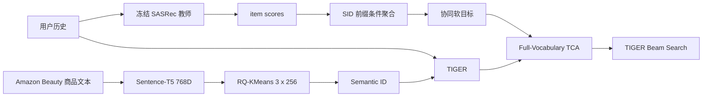

# TCA-TIGER：面向 Semantic ID 生成式推荐的协同对齐

基于 TIGER 搭建 Semantic-ID 生成式推荐系统，并参考 TCA4Rec 引入冻结 SASRec 的协同知识，通过 prefix-conditioned SID soft targets 对生成器进行 Full-Vocabulary Collaborative Alignment，在 Amazon Beauty 上将 SID-level NDCG@10 提升 6.47%，且不增加最终 TIGER 推理阶段的 teacher-model 开销。

## 动机

Semantic ID 主要编码商品文本语义，而序列推荐还需要刻画用户与商品之间的协同行为。为补充这部分信号，本项目使用冻结的 SASRec 从用户历史得到 item-level 偏好，再将其聚合为分层 SID token 的软目标。

## 方法



本项目的核心改造是：将 TCA4Rec 的 token-level collaborative alignment 适配到 TIGER，把 item 空间中的协同知识转换为 prefix-conditioned hierarchical SID supervision。教师 cache 只由训练集中的因果历史生成，并通过确定性 sample key 与 TIGER 训练样本逐条对齐。

## Full-Vocabulary TCA

每个商品的原始 SID 为 $y=[c_0,c_1,c_2]$，每层有 256 个 code。TIGER token 约定为：`0` 是 padding/decoder start，`1–256`、`257–512`、`513–768` 分别对应三层，词表大小为 769。

冻结的 SASRec 根据因果用户历史产生 item 分数，再按目标 SID 的真实前缀聚合成 $Q_{CF}^{(t)}$。第 $t$ 层的目标为：

$$Q_t=(1-\alpha)Q_{hard}+\alpha Q_{CF}^{(t)},\qquad \alpha=0.1,\;\tau=1.$$

训练损失为：

$$\mathcal{L}_{TCA}=-\sum_t\sum_{v=0}^{768}Q_t(v)\log P_\theta(v\mid H,y_{<t}).$$

每个自回归位置都保留 TIGER 原始的完整 769-token 输出空间；ground-truth 仍是主要监督，SASRec 的协同概率质量只注入当前 SID 层对应的 token 区间。这样在加入协同信息的同时，不改变 TIGER 原有的解码空间。

教师仅用于一次性生成形状为 `[131413, 3, 256]` 的 FP16 离线 cache。训练与最终推理均不需要在线运行 SASRec；部署侧仍然只有 TIGER 与 Beam Search。

## 结果

Amazon Beauty 测试集，SID-level 指标：

| 模型 | Recall@5 | Recall@10 | NDCG@5 | NDCG@10 |
| --- | ---: | ---: | ---: | ---: |
| Original TIGER | 0.0438740 | 0.0676305 | 0.0278124 | 0.0354940 |
| TIGER + Full-Vocabulary TCA | **0.0467750** | **0.0693765** | **0.0305066** | **0.0377906** |
| Relative Gain | **+6.61%** | **+2.58%** | **+9.69%** | **+6.47%** |

精确数值和 provenance 见 [`results/main_results.json`](results/main_results.json) 与 [`docs/TCA_PHASE1_FINAL_REPORT.md`](docs/TCA_PHASE1_FINAL_REPORT.md)。

## 实验协议

- 数据：Amazon Beauty 5-core；按 timestamp 稳定排序，每位用户 leave-two-out。
- 表示：Sentence-T5 768D，RQ-KMeans 三层、每层 256 code。
- 模型：T5 encoder-decoder，`d_model=128`、`d_ff=1024`、encoder/decoder 各 4 层、6 heads、dropout 0.1。
- 训练：seed 42，Adam，学习率 `1e-4`，batch 256，最大历史 50。
- 选择：所有模型均按验证集 NDCG@10 选择 checkpoint；early-stopping patience 10。
- 推理：beam size 10；报告 Recall@5/10 和 NDCG@5/10，均为 SID-level exact-match 指标。

## 复现

建议使用 Python 3.10。PyTorch/CUDA 版本应按本机驱动安装，再执行：

```bash
pip install -r requirements.txt
```

数据不会随仓库分发。请从 [Amazon Review Data](https://cseweb.ucsd.edu/~jmcauley/datasets/amazon/links.html) 获取 Beauty 5-core review 与 metadata，并放入 `dataset/amazon/raw/beauty/`。首次加载会构建预处理序列与 Sentence-T5 embedding。

1. 生成 RQ-KMeans Semantic ID：

```bash
python -m genrec.trainers.rqkmeans_trainer config/tiger/amazon/sid_rqkmeans.gin --split beauty
```

2. 提供兼容的冻结 SASRec checkpoint，并生成离线教师 cache：

```bash
python scripts/generate_tca_teacher_cache.py --checkpoint path/to/best_val_ndcg10.pth
```

教师 checkpoint 不在本仓库分发。它须匹配 `hidden=50, maxlen=50, blocks=2, heads=1, norm_first=true, padding_idx=0`；脚本会 strict load 并校验样本键。cache 约 202 MiB，仅保存在本地。

3. 训练 Original TIGER（用独立目录避免覆盖已有结果）：

```bash
python -m genrec.trainers.tiger_trainer config/tiger/amazon/tiger_rqkmeans.gin --split beauty --gin "train.selection_metric='ndcg10'" --gin "train.save_dir_root='out/reproduce/beauty/tiger'"
```

4. 训练 Full-Vocabulary TCA：

```bash
python -m genrec.trainers.tiger_trainer config/tiger/amazon/tiger_rqkmeans_tca_full_vocab_ndcg_select.gin --split beauty --gin "train.save_dir_root='out/reproduce/beauty/tiger_tca_full_vocab'"
```

5. 运行测试：

```bash
pytest tests -q
```

默认主线配置不要求 W&B 登录。模型权重、原始数据、embedding、Semantic ID 和教师 cache 均由 `.gitignore` 排除；公开仓库只包含代码、配置、测试与小型结果元数据。

## 仓库结构

```text
config/tiger/amazon/   Beauty/TIGER/RQ-KMeans/TCA 配置
genrec/data/           Amazon 序列与教师 cache 对齐
genrec/models/         TIGER、RQ-KMeans、SASRec 教师适配器
genrec/trainers/       SID 生成、TIGER 与 TCA 训练
scripts/               cache 构建与审计工具
tests/                 TCA、cache、sample alignment 与选择协议测试
docs/                  最终报告和精选技术审计
results/               可公开的小型冻结结果元数据
```

## 关键发现

- Semantic-ID 生成可以受益于 item 空间学到的协同序列知识。
- SASRec item 偏好可以转换成前缀条件 SID token 分布。
- 固定 Beauty/seed 42 实验中，Full-Vocabulary TCA 提升全部四项测试指标。
- 最大相对提升出现在 NDCG@5（+9.69%）与 NDCG@10（+6.47%）。
- 教师只参与离线监督生成，最终推理仍为 TIGER-only。

## 局限

- 最终主实验只有 Amazon Beauty 和一个随机种子，不主张统计显著性。
- 评估是 SID-level，不等价于具有碰撞消解与历史过滤的 item-level serving。
- 不同商品可能共享 SID；当前 evaluator 不解决 SID collision。
- 结果依赖冻结 SASRec 教师的质量，精确复现需要用户自行提供兼容 checkpoint。

## 参考文献

- Rajput et al. *Recommender Systems with Generative Retrieval*. NeurIPS 2023（TIGER）。
- Ni et al. *Sentence-T5: Scalable Sentence Encoders from Pre-trained Text-to-Text Models*. Findings of ACL 2022。
- Kang and McAuley. *Self-Attentive Sequential Recommendation*. ICDM 2018（SASRec）。
- Lee et al. *Autoregressive Image Generation Using Residual Quantization*. CVPR 2022（Residual Quantization / RQ-VAE）。
- Lin et al. *Token-level Collaborative Alignment for LLM-based Generative Recommendation*. The Web Conference 2026（TCA4Rec；本项目为 TIGER 适配）。
