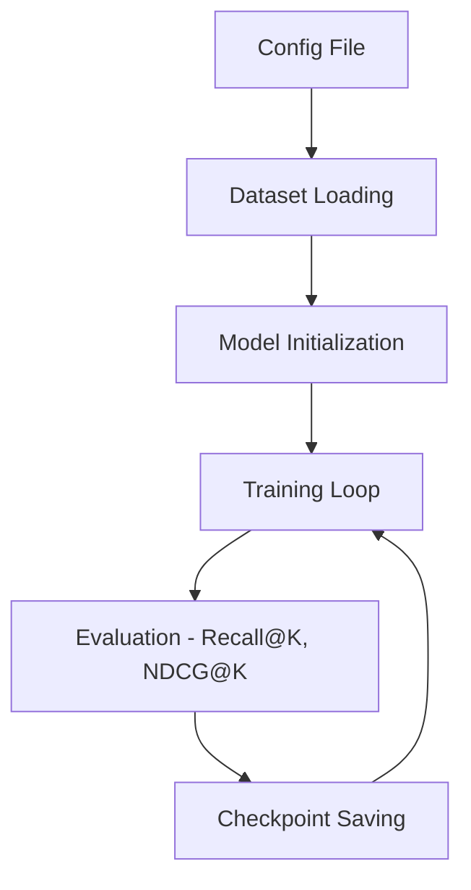
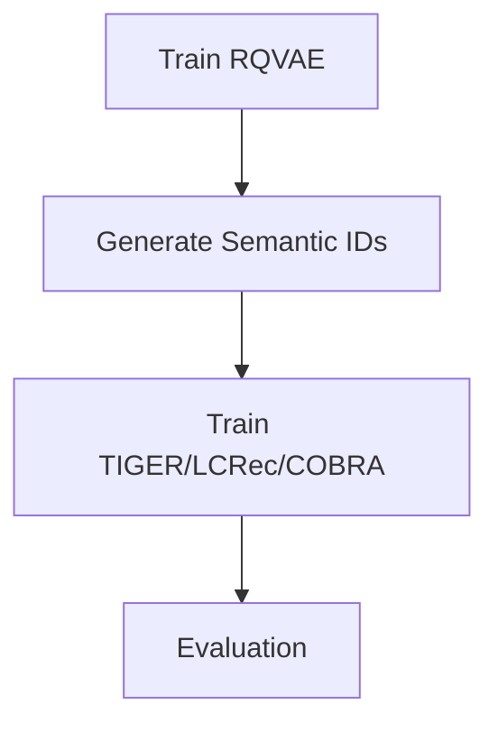

# Getting Started

This guide will help you quickly get started with GenRec.

## Prerequisites

- Python 3.9 or higher
- CUDA 11.0+ (for GPU training)
- 8GB+ GPU memory (recommended)

## Installation

### 1. Clone the Repository

```bash
git clone https://github.com/phonism/genrec.git
cd genrec
```

### 2. Install

```bash
pip install -e .
```

Or install dependencies only:

```bash
pip install -r requirements.txt
```

### 3. Prepare Data

Datasets are automatically downloaded during training. For Amazon 2014:

```bash
mkdir -p dataset/amazon
```

For Amazon 2023:

```bash
mkdir -p dataset/amazon2023
```

## Train Baseline Models

### SASRec

```bash
python genrec/trainers/sasrec_trainer.py config/sasrec/amazon.gin --split beauty
```

### HSTU

```bash
python genrec/trainers/hstu_trainer.py config/hstu/amazon.gin --split beauty
```

Available splits for Amazon 2014: `beauty`, `sports`, `toys`, `clothing`

For Amazon 2023 datasets, use dedicated config files:

```bash
python genrec/trainers/sasrec_trainer.py config/sasrec/amazon2023.gin
python genrec/trainers/hstu_trainer.py config/hstu/amazon2023.gin
```

## Train Generative Models

Generative models (TIGER, LCRec, COBRA) require a pretrained RQVAE checkpoint to generate semantic IDs.

### Step 1: Train RQVAE

```bash
# For TIGER
python genrec/trainers/rqvae_trainer.py config/tiger/amazon/rqvae.gin --split beauty

# For LCRec
python genrec/trainers/rqvae_trainer.py config/lcrec/amazon/rqvae.gin --split beauty

# For COBRA
python genrec/trainers/rqvae_trainer.py config/cobra/amazon/rqvae.gin --split beauty
```

### Step 2: Train the Model

```bash
# TIGER
python genrec/trainers/tiger_trainer.py config/tiger/amazon/tiger.gin --split beauty

# LCRec
python genrec/trainers/lcrec_trainer.py config/lcrec/amazon/lcrec.gin --split beauty

# COBRA
python genrec/trainers/cobra_trainer.py config/cobra/amazon/cobra.gin --split beauty
```

### Amazon 2023 Datasets

```bash
# TIGER on Amazon 2023
python genrec/trainers/rqvae_trainer.py config/tiger/amazon2023/rqvae.gin
python genrec/trainers/tiger_trainer.py config/tiger/amazon2023/tiger.gin

# LCRec on Amazon 2023
python genrec/trainers/rqvae_trainer.py config/lcrec/amazon2023/rqvae.gin
python genrec/trainers/lcrec_trainer.py config/lcrec/amazon2023/lcrec.gin
```

## Monitor Training

Enable Weights & Biases logging in your config:

```gin
train.wandb_logging=True
train.wandb_project="your_project_name"
```

Visit [wandb.ai](https://wandb.ai) to view training progress.

## Configuration

### Override Parameters

Use `--gin` to override any parameter:

```bash
python genrec/trainers/tiger_trainer.py config/tiger/amazon/tiger.gin \
    --split beauty \
    --gin "train.epochs=200" \
    --gin "train.batch_size=128"
```

### Custom Model Path (LCRec)

```bash
python genrec/trainers/lcrec_trainer.py config/lcrec/amazon/lcrec.gin \
    --split beauty \
    --gin "MODEL_HUB_QWEN3_1_7B='/path/to/model'"
```

## Training Pipeline



For generative models:



## Next Steps

- Learn about [Model Architectures](models/sasrec.md)
- Understand [Dataset Processing](dataset/overview.md)
- Check [API Documentation](api/index.md)
- Explore [Advanced Examples](examples.md)
