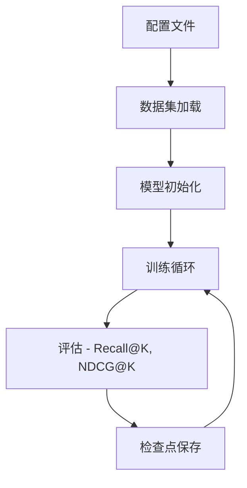
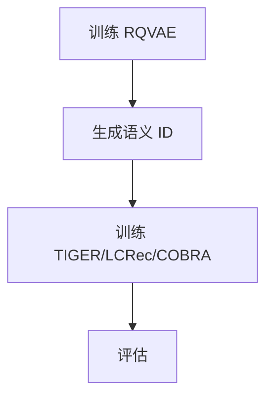

# 快速开始

本指南将帮助您快速上手 GenRec 框架。

## 前置要求

- Python 3.9 或更高版本
- CUDA 11.0+（GPU 训练）
- 8GB+ GPU 显存（推荐）

## 安装

### 1. 克隆仓库

```bash
git clone https://github.com/phonism/genrec.git
cd genrec
```

### 2. 安装

```bash
pip install -e .
```

或仅安装依赖：

```bash
pip install -r requirements.txt
```

### 3. 准备数据

数据集会在训练时自动下载。对于 Amazon 2014：

```bash
mkdir -p dataset/amazon
```

对于 Amazon 2023：

```bash
mkdir -p dataset/amazon2023
```

## 训练基线模型

### SASRec

```bash
python genrec/trainers/sasrec_trainer.py config/sasrec/amazon.gin --split beauty
```

### HSTU

```bash
python genrec/trainers/hstu_trainer.py config/hstu/amazon.gin --split beauty
```

Amazon 2014 可选数据集：`beauty`、`sports`、`toys`、`clothing`

对于 Amazon 2023 数据集，使用专用配置文件：

```bash
python genrec/trainers/sasrec_trainer.py config/sasrec/amazon2023.gin
python genrec/trainers/hstu_trainer.py config/hstu/amazon2023.gin
```

## 训练生成式模型

生成式模型（TIGER、LCRec、COBRA）需要预训练的 RQVAE 检查点来生成语义 ID。

### 步骤 1：训练 RQVAE

```bash
# 用于 TIGER
python genrec/trainers/rqvae_trainer.py config/tiger/amazon/rqvae.gin --split beauty

# 用于 LCRec
python genrec/trainers/rqvae_trainer.py config/lcrec/amazon/rqvae.gin --split beauty

# 用于 COBRA
python genrec/trainers/rqvae_trainer.py config/cobra/amazon/rqvae.gin --split beauty
```

### 步骤 2：训练模型

```bash
# TIGER
python genrec/trainers/tiger_trainer.py config/tiger/amazon/tiger.gin --split beauty

# LCRec
python genrec/trainers/lcrec_trainer.py config/lcrec/amazon/lcrec.gin --split beauty

# COBRA
python genrec/trainers/cobra_trainer.py config/cobra/amazon/cobra.gin --split beauty
```

### Amazon 2023 数据集

```bash
# TIGER（Amazon 2023）
python genrec/trainers/rqvae_trainer.py config/tiger/amazon2023/rqvae.gin
python genrec/trainers/tiger_trainer.py config/tiger/amazon2023/tiger.gin

# LCRec（Amazon 2023）
python genrec/trainers/rqvae_trainer.py config/lcrec/amazon2023/rqvae.gin
python genrec/trainers/lcrec_trainer.py config/lcrec/amazon2023/lcrec.gin
```

## 监控训练

在配置中启用 Weights & Biases 日志：

```gin
train.wandb_logging=True
train.wandb_project="your_project_name"
```

访问 [wandb.ai](https://wandb.ai) 查看训练进度。

## 配置

### 参数覆盖

使用 `--gin` 覆盖任意参数：

```bash
python genrec/trainers/tiger_trainer.py config/tiger/amazon/tiger.gin \
    --split beauty \
    --gin "train.epochs=200" \
    --gin "train.batch_size=128"
```

### 自定义模型路径（LCRec）

```bash
python genrec/trainers/lcrec_trainer.py config/lcrec/amazon/lcrec.gin \
    --split beauty \
    --gin "MODEL_HUB_QWEN3_1_7B='/path/to/model'"
```

## 训练流程



生成式模型流程：



## 下一步

- 了解[模型架构](models/sasrec.md)
- 学习[数据集处理](dataset/overview.md)
- 查看[API 文档](api/index.md)
- 探索[高级示例](examples.md)
